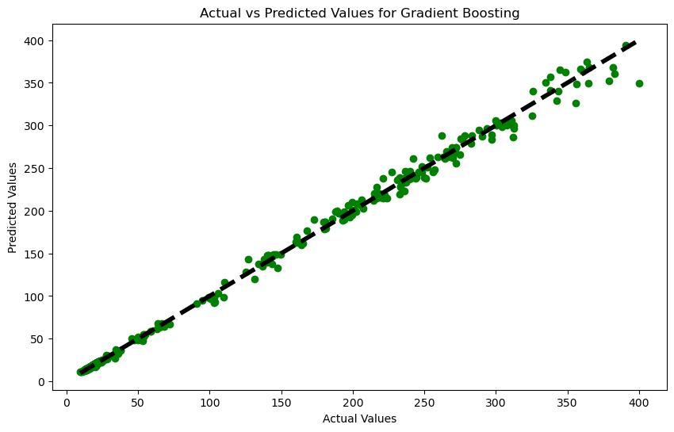
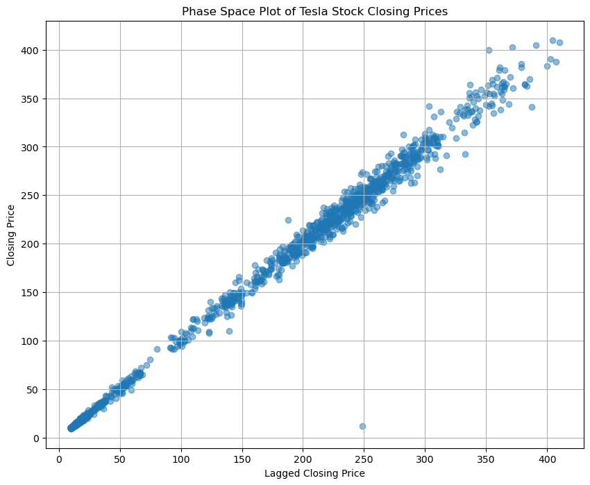

# Hybrid Forecasting Framework: Non-Linear Dynamics + Machine Learning for Tesla Stock Prediction

MSc Data Science dissertation project (London South Bank University, 2024). This project builds a hybrid forecasting framework that combines chaos-theory-inspired non-linear features (Lyapunov exponent estimation, phase-space embedding) with engineered technical indicators (RSI, CCI, historical volatility) and ensemble machine learning models to predict Tesla (TSLA) stock closing prices.

## Key Results

Final held-out model validation:

| Model | MSE | MAE | R² |
|---|---|---|---|
| **Gradient Boosting Regressor** | 142.98 | 2.95 | **0.9309** |
| Random Forest Regressor | 159.76 | 4.42 | 0.9228 |

5-fold cross-validation (training phase):

| Model | Mean CV R² | Std Dev |
|---|---|---|
| Random Forest | 0.951 | ±0.021 |
| Gradient Boosting | 0.940 | ±0.036 |

Walk-forward (out-of-time) evaluation, tested on unseen future periods:

| Period | RF R² | GBR R² |
|---|---|---|
| 2019 | 0.991 | 0.994 |
| 2020 | 0.996 | 0.997 |

The Gradient Boosting Regressor consistently outperformed the Random Forest model on the final held-out test set, while both models maintained strong performance under walk-forward validation across different time periods, indicating reasonable robustness to temporal shift within the tested window.



## Methodology

1. **Data collection & cleaning** — 10 years of daily TSLA OHLCV data (2014–2023), with missing-value handling and outlier treatment.
2. **Feature engineering**
   - Technical indicators: RSI (7 & 14-day), CCI, historical volatility
   - Non-linear dynamics features: Lyapunov exponent estimation, phase-space embedding (lagged closing price relationships)
   - Lagged variables, rolling means/std, polynomial features
3. **Modelling** — Random Forest and Gradient Boosting regressors, tuned via `GridSearchCV` and evaluated with 5-fold cross-validation.
4. **Evaluation** — MSE, RMSE, MAE, R², Explained Variance, and Median Absolute Error, benchmarked on a held-out test set and validated further via walk-forward testing across distinct historical periods.



## Repository Structure

├── dissertation_project.ipynb   # Full analysis notebook (recommended entry point)
├── dissertation_project.py      # Script version of the same pipeline
├── tsla_2014_2023.csv           # Raw historical TSLA price data
├── tsla_cleaned.csv             # Cleaned dataset after preprocessing
└── requirements.txt             # Python dependencies

## Tech Stack

Python · Pandas · NumPy · SciPy · Scikit-learn · Matplotlib · Seaborn · Jupyter Notebook

## Running Locally

```bash
pip install -r requirements.txt
jupyter notebook dissertation_project.ipynb
```

## Author

**Yogendra Singh Rohilla**
MSc Data Science (Merit), London South Bank University
Dissertation supervised by Mr George Bamfo
[LinkedIn](https://linkedin.com/in/1yogendra-singh-rohilla-7b7a79137) · yogenderrohilla2408@gmail.com
